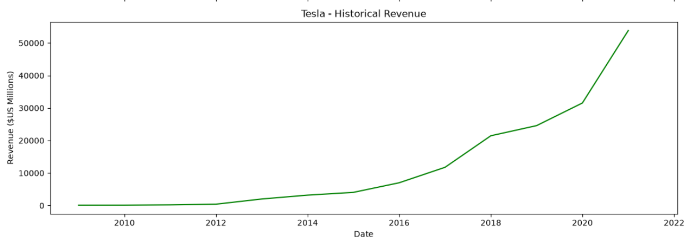
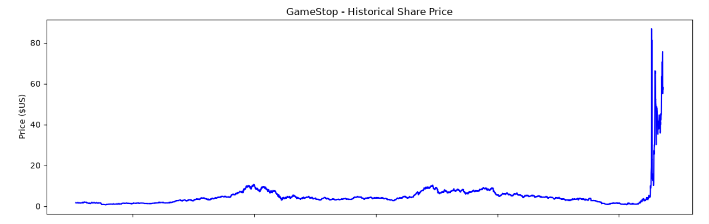

# MarketMiner: Yahoo Finance Stock Scraper

## Overview
This project extracts stock market data from Yahoo Finance using Python and Beautiful Soup.

## Objectives

- Retrieve stock information dynamically
- Parse HTML content
- Clean extracted data
- Generate visualizations

## Technologies

- Python
- Beautiful Soup
- Requests
- Pandas
- Matplotlib

## Repository Structure

```text
marketminer-stock-scraper/

│
├── data/
│   └── sample_data/
│       └── stock_sample.csv
│
├── images/
│   └── project_banner.png
|
├── notebooks/
│   └── stock_scraping_analysis.ipynb
│
├── outputs/
│   ├── charts/
│   │   ├── gamestop_historical_revenue.png
│   │   ├── gamestop_historical_share_price.png
│   │   ├── tesla_historical_revenue.png
│   │   └── tesla_historical_share_price.png
│   │
│   └── csv/
│       └── sample_stock.csv
│
├── src/
│   ├── scrape.py
│   ├── parse.py
│   ├── clean.py
│   └── utils.py
│
├── .gitignore
├── main.py
├── README.md
└── requirements.txtmain.py
```

## Sample Data

Sample scraped data can be found in:

data/sample_data/

## Outputs

### Scraped Tesla Data
#### Tesla Revenue Trend



#### Tesla Stock Price Trend


### Scraped GameStop Data
#### GameStop Revenue Trend


#### GameStop Stock Price Trend


## Future Improvements

- Support multiple ticker symbols
- Add Streamlit dashboard
- Automate scheduled scraping